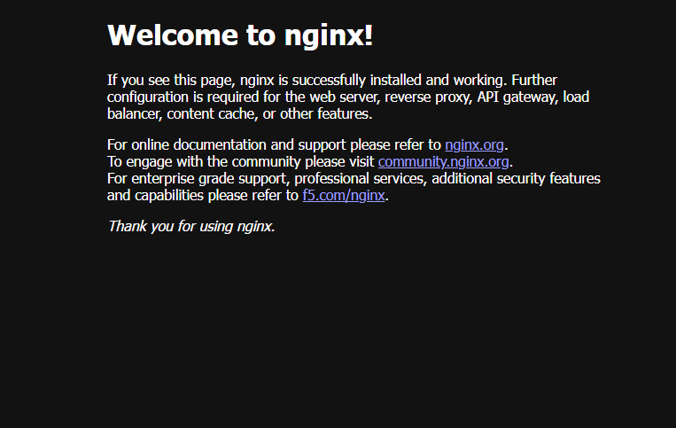

# ☸️ Automated EKS Infrastructure & Application Deployment
[](https://aws.amazon.com/)
[](https://kubernetes.io/)
[](https://www.ansible.com/)
[](https://github.com/MuhammadAbdelkader/eks-ansible-deploy)

## 📌 Executive Summary
This repository showcases a **production-grade automation workflow** for deploying scalable web applications on **Amazon EKS (Elastic Kubernetes Service)**. By bridging the gap between Infrastructure as Code (IaC) and Kubernetes orchestration, this project automates the entire lifecycle of a containerized service—from VPC networking adjustments to global Load Balancer provisioning.

## 🏗️ Architecture & Engineering Logic
The deployment is engineered with a focus on **High Availability (HA)** and **Security**. 

### 🔐 Security & Network Hardening
* **Subnet-Level Isolation:** Strategic tagging of Public Subnets (`kubernetes.io/role/elb`) ensuring traffic is routed through authorized entry points.
* **Scheme Enforcement:** Explicitly defining `internet-facing` annotations to prevent accidental exposure of internal resources.
* **Namespace Segregation:** Deployment is isolated within a dedicated `production` namespace to follow the principle of least privilege.

### ⚙️ Automation Stack
- **Ansible:** Orchestrates the deployment of Kubernetes manifests, managing state and ensuring idempotency.
- **EKS Auto Mode:** Leverages AWS-native integration for dynamic resource provisioning.

---

## 🖼️ Proof of Concept (Deployment Result)
Below is the verified output of the automated deployment, showcasing the successfully provisioned Nginx server via AWS Load Balancer.

<p align="center">
  
  <br>
  <em>Figure 1: Verified external access through AWS ELB DNS.</em>
</p>

---

## 🚀 Deployment Guide

### Prerequisites
- **AWS CLI** configured with appropriate IAM permissions.
- **Ansible** installed with the `kubernetes.core` collection.
- **kubectl** authenticated with your EKS Cluster.

### Execution
1. **Clone the repository:**
   ```bash
   git clone https://github.com/MuhammadAbdelkader/eks-ansible-deploy.git
   cd eks-ansible-deploy
   ```
2. **Apply Configuration:**
   ```bash
   ansible-playbook -i inventory.ini deploy.yml
   ```
3. **Verify Service Status:**
   ```bash
   kubectl get svc -n production
   ```

## 🛠️ Skills Highlighted
| Domain | Proficiency |
| :--- | :--- |
| **Cloud Infrastructure** | AWS (EKS, VPC, IAM, ELB Tagging) |
| **DevOps & Automation** | Infrastructure as Code (Ansible), CI/CD Logic |
| **Orchestration** | Service Types, Annotations, Deployment Controllers |
| **Engineering** | Technical Documentation, Critical Troubleshooting |

---

## 👨‍💻 About the Author
**Mohamed Abdelkader** **Software & Technical Engineer** *Final Year Information Systems Student @ Benha University*

Highly focused on Cloud Architecture, DevOps Automation, and building secure, scalable system logic. 

[](https://www.linkedin.com/in/MuhammadAbdelkader)
[](https://github.com/MuhammadAbdelkader)
